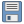

# QGIS Toolbar Reference

Keep this reference handy when arranging QGIS panels in Weeks 1–2.

## Recommended layout

- Top menu: Project, File, Edit, View, Layer, Plugins, Vector, Raster.
- Toolbar order (left → right):
  1. Project (New, Open, Save)
  2. Map Navigation (Pan, Zoom In/Out, Zoom Full, Zoom to Layer)
  3. Attributes (Identify, Select by Rectangle/Polygon/Freehand)
  4. Digitizing (Toggle Editing, Add Feature, Move Feature)
  5. Snapping (Snapping On/Off, Snapping Options)
  6. View/Measure (Measure Line/Area, Overview)
  7. Plugin shortcuts (Value Tool, QuickMapServices when enabled)

Drag toolbars using the dotted handle on their left edge. Collapse infrequently used toolbars to the side to reduce clutter.

## Icon cheat sheet

### Navigation tools

| Icon | Name | Shortcut | What it does |
|:----:| ---- | -------- | ------------ |
| {: style="height:1.5em; vertical-align:middle" } | Pan | Hold Space | Move around the map without changing scale |
| {: style="height:1.5em; vertical-align:middle" } | Zoom In | Mouse wheel up | Focus on a smaller area |
| {: style="height:1.5em; vertical-align:middle" } | Zoom Out | Mouse wheel down | View a larger area |
| {: style="height:1.5em; vertical-align:middle" } | Zoom Full | `Ctrl/Cmd + Shift + F` | Reset view to full layer extent |
| {: style="height:1.5em; vertical-align:middle" } | Zoom to Layer | — | Zoom to selected layer's extent |

### Project tools

| Icon | Name | Shortcut | What it does |
|:----:| ---- | -------- | ------------ |
| {: style="height:1.5em; vertical-align:middle" } | Save Project | `Ctrl/Cmd + S` | Save current work |
| {: style="height:1.5em; vertical-align:middle" } | Open Project | `Ctrl/Cmd + O` | Load an existing `.qgz` |

### Data tools

| Icon | Name | Shortcut | What it does |
|:----:| ---- | -------- | ------------ |
| {: style="height:1.5em; vertical-align:middle" } | Add Vector Layer | `Ctrl/Cmd + Shift + V` | Load shapefiles, GeoPackages, etc. |
| {: style="height:1.5em; vertical-align:middle" } | Add Raster Layer | `Ctrl/Cmd + Shift + R` | Load DEMs, imagery, etc. |
| {: style="height:1.5em; vertical-align:middle" } | Identify Features | `Ctrl/Cmd + Shift + I` | Inspect attributes by clicking features |
| {: style="height:1.5em; vertical-align:middle" } | Open Attribute Table | `F6` | View layer's data table |
| {: style="height:1.5em; vertical-align:middle" } | Select Features | — | Select features spatially |

### Layout tools (Print Layout window)

| Icon | Name | What it does |
|:----:| ---- | ------------ |
| {: style="height:1.5em; vertical-align:middle" } | Add Map | Insert map canvas into layout |
| {: style="height:1.5em; vertical-align:middle" } | Add Label | Add text (titles, credits) |
| {: style="height:1.5em; vertical-align:middle" } | Add Legend | Add map legend |
| {: style="height:1.5em; vertical-align:middle" } | Add Scale Bar | Add scale reference |
| {: style="height:1.5em; vertical-align:middle" } | Add Picture | Add images (logos, photos) |
| {: style="height:1.5em; vertical-align:middle" } | Add Arrow | Add directional arrows |
| {: style="height:1.5em; vertical-align:middle" } | Add Shape | Add rectangles, circles, etc. |

## Tips for customisation

- Keep only the toolbars you need (`View ▶ Toolbars`).
- Customise shortcuts (`Settings ▶ Keyboard Shortcuts`) to match your workflow.
- Reset the toolbar layout via `Settings ▶ Options ▶ System ▶ Reset user interface` if things get messy.
- Take a screenshot of your configured interface to reference later or share with classmates.
