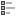

# Week 2 · Symbology, Labelling & Layouts

A map is more than just data on a canvas—it's a communication tool. This week, you'll learn how to make intentional design choices that guide your audience's eye, tell clear stories, and make your maps accessible to diverse audiences. You'll master advanced symbology techniques, create intelligent labels, and assemble polished layouts that look professional.

## What you'll learn

By the end of this week, you'll be able to:

1. Apply graduated, categorised, and rule-based symbology to communicate spatial patterns.
2. Configure labels with data-driven styling and scale-dependent rules.
3. Design an export-ready layout using cartographic design principles (hierarchy, balance, accessibility).

## Before you start

- [ ] Reopen your Week 1 project and ensure Natural Earth layers load correctly
- [ ] Bring an inspirational map to share (digital or printed)—note one design element you appreciate
- [ ] Review the lecture: [Cartographic Conventions & Colour](../lectures/week02-cartography.md)
- [ ] Download Week 2 datasets (renewable energy CSV, world cities) via [Downloading datasets](../onboarding/03-download-data.md)
- [ ] Check off Week 2 items in the [data download checklist](../reference/data-download-checklist.md)
- [ ] Skim the [Layout Template guide](../reference/layout-template.md) for reference

## This week's activities

### Activity 1: Design show-and-tell (in class/async)

Before diving into technical skills, let's build design awareness by looking at real maps.

**Steps:**

1. Share the inspirational map you brought—what makes it effective?
2. As a group, identify design elements that work: color choices, hierarchy, labels, white space
3. Discuss examples of maps that fail—what went wrong?
4. Introduce design vocabulary: visual hierarchy, balance, contrast, accessibility

!!! tip "Build your inspiration library"
    Start collecting maps you admire (screenshots, bookmarks, Pinterest boards). Analyzing good design is one of the best ways to improve your own work.

### Activity 2: Style renewable energy data with classification methods

You'll join renewable energy data to countries and experiment with different classification methods to see how they change the story.

!!! info "What is a CSV file?"
    CSV (Comma-Separated Values) is a simple spreadsheet format. It's just a text file where each line is a row and commas separate columns. You can open CSVs in Excel, Google Sheets, or any text editor.

    Unlike shapefiles, CSVs don't have geometry (shapes)—they're just data tables. To map CSV data, you either:

    - **Join** it to a layer that already has geometry (like country boundaries)
    - Load it with **coordinates** if it has latitude/longitude columns

**Steps:**

1. Download the renewable energy CSV (see pre-work checklist)
2. Load it as a delimited text layer:
   - `Layer ▶ Add Layer ▶ Add Delimited Text Layer`
   - **File name:** browse to your CSV file
   - **Geometry definition:** set to **No geometry (attribute table only)**
   - Click **Add**, then **Close**

!!! tip "What does 'delimited' mean?"
    "Delimited" means the columns are separated by a character—usually commas (CSV) or tabs (TSV). QGIS detects this automatically.

3. Join the CSV data to your countries layer:

!!! info "What is a join?"
    A join connects two tables using a matching code. Think of it like a lookup:

    - Your **CSV** has data: `AUS → 25% renewable`
    - Your **shapefile** has shapes: `AUS → [Australia polygon]`
    - The **join** combines them: `AUS → [Australia polygon] + 25% renewable`

    The code must match exactly. "AUS" won't match "Australia" or "aus".

   - Right-click countries layer → **Properties** → **Joins** tab
   - Click **+** to add a join
   - **Join layer:** your renewable energy CSV
   - **Join field:** the column in the CSV with country codes (e.g., "ISO_A3" or "code")
   - **Target field:** the matching column in Natural Earth (usually "ISO_A3")
   - Click OK

4. Verify the join worked:
   - Open the attribute table (right-click layer → Open Attribute Table)
   - Scroll right—you should see new columns from the CSV
   - If columns show NULL/blank, the codes didn't match (check spelling and capitalization)
5. Apply **Graduated** symbology:
   - Layer Properties → Symbology → Graduated
   - **Value:** renewable energy percentage field
   - **Method:** Try each one and observe the differences:
     - **Quantile** (equal number of countries per class)
     - **Equal Interval** (equal numeric ranges)
     - **Natural Breaks (Jenks)** (minimizes variance within classes)
   - **Classes:** 5
   - **Color ramp:** choose a ColorBrewer sequential palette (e.g., YlGnBu)
6. Compare the three methods—which tells the clearest story? Which is most appropriate for your data distribution?

!!! note "No single right answer"
    Classification method choice depends on your data distribution and your message. Quantile ensures visual balance but can group very different values. Natural Breaks highlights genuine clusters but can create uneven class sizes.

### Activity 2.5: Classification as choice

Classification methods determine how your map groups data—and different methods tell different stories about the same numbers. This activity makes that visible.

**The question to carry through this exercise:** Who decided these groupings, and what does each choice emphasize?

**Steps:**

1. With your renewable energy choropleth visible, note your current classification method and the class breaks shown in the legend
2. Take screenshots of all three versions (you may already have them from Activity 2):

   **Version A: Quantile (Equal Count)**
   - Classes: 5, Mode: Quantile
   - Note which countries fall into each class

   **Version B: Equal Interval**
   - Classes: 5, Mode: Equal Interval
   - Note the legend values

   **Version C: Natural Breaks (Jenks)**
   - Classes: 5, Mode: Natural Breaks
   - Note how breaks differ from the other methods

3. Find a country with 15-20% renewable energy (like Germany or Japan) and check which class it falls into for each method. Does it appear "above average," "below average," or "middle"?

4. Answer these questions:
   - Which method makes differences between countries look **largest**?
   - Which method makes a country with 15% renewable look **best**? **Worst**?
   - If you were advocating for increased renewable investment, which method would support your argument?

!!! tip "The point isn't that maps lie"
    Maps don't lie—they answer specific questions. The skill is recognizing WHICH question each classification answers:

    - **Quantile:** "How does each country rank relative to others?"
    - **Equal Interval:** "How do countries compare to an absolute scale?"
    - **Natural Breaks:** "Where are the natural clusters in this data?"

    Choose based on your question—and be explicit about your choice when presenting.

**Reflection prompt:** In your Week 2 reflection, describe how classification choice changed the story. Which method did you choose for your final map, and why?

### Activity 3: Add labels for major world cities

Labels turn abstract geography into recognizable places. You'll create smart labels that appear only when appropriate.

**Steps:**

1. Add the world cities file:
   - `Layer ▶ Add Layer ▶ Add Delimited Text Layer`
   - **File name:** `resources/data/processed/week02/worldcities.csv`
   - **Geometry definition:** Point coordinates → X field = `lng`, Y field = `lat`
   - **CRS:** `EPSG:4326 – WGS 84`
   - Click **Add**, then **Close**. The layer should appear in your Layers panel.
2. Filter to major cities:
   - Right-click layer → **Filter...**
   - Expression: `"population" > 5000000` (5 million+)
   - Click OK
3. Enable labels:
   - Layer Properties → **Labels** tab
   - Change **No Labels** to **Single Labels**
   - **Value:** city name field
4. Style the labels:
   - **Font:** choose something readable (Arial, Open Sans, etc.)
   - **Size:** 10-12 pt
   - **Buffer:** Check "Draw text buffer" (white, 1-2mm) so labels stand out over the map
5. Add scale-dependent visibility:
   - In Labels tab, go to **Rendering** section
   - Check "Scale dependent visibility"
   - **Maximum (most out):** 1:50,000,000 (labels disappear when zoomed out beyond this)
   - **Minimum (most in):** 1:100,000 (labels disappear when zoomed in too close)
6. Zoom in and out to test—labels should appear at appropriate scales

**Challenge:** Use **Expression-based labels** to show both city name and population:
- In the Labels tab, click the **ε** button next to Value
- Enter expression: `"name" || ' (' || format_number("population" / 1000000, 1) || 'M)'`
- This shows: "Tokyo (37.4M)"

### Activity 4: Scale city point sizes using population

Next, symbolise those same cities so marker size reflects population. The quick way in QGIS is to use Graduated symbology but switch the method to **Size** so the renderer handles all the math and legend work for you.

**Steps:**

1. **Duplicate the filtered cities layer** from Activity 3 so labels stay untouched:
   - Right-click the layer → **Duplicate Layer** → rename to `Major Cities – Population Size`.
2. **In the Layer Styling panel**, use the drop-down menu at the top to switch the renderer from **Single Symbol** to **Graduated** (you can also open Layer Properties if you prefer the full dialog).
3. **Choose the population field for Value**:
   - Set **Value** to ` "population" / 1000000 ` so the classifier works in millions (the legend will read cleaner numbers like 5 M instead of 5,000,000)
   - Set **Mode:** Quantile and **Classes:** 4
4. **Change the Method from Color to Size** using the drop-down right under the class list. This tells QGIS to leave colour alone and only vary marker sizes.
5. **Click Classify** so QGIS builds the ranges and previews the different symbol sizes.
6. Finish the styling:
   - Set **Symbol size – Min** = `2.5 mm`, **Max** = `10 mm`
   - Choose one fill colour (e.g., coral) with a white 0.3 mm stroke so each class stays visually consistent
   - Rename each class label to something friendly (e.g., `1–4 M`, `4–8 M`, `8–15 M`, `15 M+`). These labels feed directly into the legend.
7. **Match visibility with your labels**:
   - In the **Rendering** tab, tick **Scale dependent visibility**
   - Use the same min/max scales as Activity 3 (e.g., 1:100,000,000 to 1:100,000)
   - Click **OK**.
8. **Preview the legend:** `Layout ▶ Add Legend` already pulls in the size classes. If you need more control, add `Layout ▶ Add Item ▶ Data-defined size legend` and select the `Major Cities – Population Size` layer so the legend lists sample sizes such as 5 M, 15 M, 30 M.

!!! tip "Need a gut-check?"
    Hover over cities with {: style="height:1.2em; vertical-align:middle" } **Identify Features** to confirm a 30 M city draws noticeably bigger than a 5 M city. If not, either widen the min/max symbol sizes or reduce the number of classes so differences read clearly.

### Activity 5: Create a professional layout

Now you'll assemble everything into a polished, export-ready map.

**Steps:**

1. Create a new Print Layout: `Project ▶ New Print Layout...` → name it "Renewable Energy Map"
2. Set up your canvas:
   - Right-click canvas → **Page Properties**
   - Set to A3 Landscape (or your preferred size)
3. Add the map:
   - {: style="height:1.2em; vertical-align:middle" } **Add Map** tool → draw a large rectangle covering most of the page
   - Leave margins for title, legend, and credits
4. Add a title:
   - {: style="height:1.2em; vertical-align:middle" } **Add Label** → draw a box at the top
   - Text: "Global Renewable Energy Share by Country, 2023"
   - Font: 20-24pt, bold
5. Add a legend:
   - {: style="height:1.2em; vertical-align:middle" } **Add Legend** → draw a box (usually right side or bottom) for your choropleth and other layers
   - In Item Properties, remove unnecessary items (uncheck layers you don't want shown)
   - Rename legend items to be reader-friendly (not technical field names). The `Major Cities – Population Size` entry will already display the differently sized markers because the renderer is in **Size** mode; if you also added a dedicated data-defined size legend, position it directly beside the main legend for clarity.
6. Add a scale bar:
   - {: style="height:1.2em; vertical-align:middle" } **Add Scale Bar** → draw at bottom of map
   - Choose a style that matches your map aesthetic (single box, line ticks, etc.)
7. Add an inset map (optional but impressive):
   - {: style="height:1.2em; vertical-align:middle" } **Add Map** → draw a small rectangle in the corner
   - In Item Properties → **Map 1**, **Lock layers** and **Lock styles**
   - Zoom this second map out to show global context
   - Draw a rectangle shape showing the extent of your main map
8. Add data credits:
   - {: style="height:1.2em; vertical-align:middle" } **Add Label** → small text at bottom
   - Text: "Data: Natural Earth, Our World in Data | Map: [Your Name], 2024"
9. Export:
   - `Layout ▶ Export as Image...` → save to `exports/week02_renewable_energy.png`
   - `Layout ▶ Export as PDF...` → save PDF version for print quality

!!! tip "Grid and guides"
    Use **View ▶ Show Grid** and **View ▶ Show Guides** to align elements precisely. Hold Shift while dragging to maintain proportions.

### Activity 6: Accessibility check

Make sure your map is readable by everyone, including those with color vision deficiencies.

**Steps:**

1. Check color contrast:
   - Visit a contrast checker (e.g., [WebAIM Contrast Checker](https://webaim.org/resources/contrastchecker/))
   - Test your text colors against background colors
   - Aim for WCAG AA standard (4.5:1 contrast ratio minimum)
2. Simulate color blindness:
   - Use a tool like [Color Oracle](https://colororacle.org/) or [Coblis](https://www.color-blindness.com/coblis-color-blindness-simulator/)
   - View your map through different color vision simulations
   - Adjust your palette if categories become indistinguishable
3. Check font sizes:
   - Minimum 8-9pt for printed maps
   - Minimum 10-12pt for screen display
4. Write alt text (for future web publication):
   - Draft a one-sentence description: "Choropleth map showing renewable energy share ranges from <5% (yellow) to >40% (dark blue), with highest adoption in Northern Europe and lowest in fossil fuel-producing nations."

## Troubleshooting

### Graduated symbology shows no variation (all one color)
- **Wrong field selected:** Make sure you selected a numeric field, not text
- **All values are the same:** Check the attribute table—does the column have variation?
- **Click Classify:** You must click the "Classify" button after changing settings
- **Data type issue:** If values imported as text, use Field Calculator to convert: `to_real("field_name")`

### Labels overlap or are unreadable
- **Enable placement engine:** `Layer Properties ▶ Labels ▶ Rendering ▶ Check "Show all labels for this layer"`
- **Use automated placement:** Try `Placement ▶ Mode ▶ Free (Angled)` or `Around Point`
- **Add background:** `Labels ▶ Background ▶ Enable` with white fill and small buffer
- **Scale-dependent visibility:** Set labels to appear only at certain zoom levels in `Rendering ▶ Scale-dependent visibility`

### Color ramp doesn't look right
- **Inverted colors:** Click the dropdown arrow next to the color ramp → "Invert Color Ramp"
- **Wrong number of classes:** Adjust the "Classes" number and re-classify
- **Custom colors needed:** Click on individual class symbols to change colors manually

### Print Layout issues
- **Map doesn't update:** Click **Refresh** or check "Lock layers" is unchecked in Map Item Properties
- **Legend shows wrong items:** In Legend Properties, uncheck "Auto update" and manually remove/rename entries
- **Scale bar is wrong:** Check the map item's scale in properties, or set a specific scale
- **Export is blurry:** Increase DPI to 300 for print quality in Export settings

### Can't find Layout Manager
- **Open it:** `Project ▶ Layout Manager` or `Project ▶ New Print Layout`
- **Layouts not saving:** Layouts are saved within the .qgz project file—save your project

### CSV data won't join to shapefile
- **Field type mismatch:** Country names must match exactly (case-sensitive)
- **Encoding issues:** Re-import CSV with UTF-8 encoding
- **Extra spaces:** Use Field Calculator to trim: `trim("field_name")`

## Support materials

- Slides: [Week 02 lecture deck](../slides/index.md)
- Template: [Layout template guide](../reference/layout-template.md)
- Toolbar reference: [Quick styling tools](../reference/toolbar.md)
- Dataset checklist: [Week 2 items](../reference/data-download-checklist.md)

## Reflect

Take 10-15 minutes to answer these questions in your [Week 2 reflection](../reference/reflections.md#week-2--symbology--layouts):

- Which classification method (quantile, equal interval, natural breaks) felt most appropriate for the renewable energy data? Why?
- What design choices did you make in your layout (color, placement, hierarchy)? What impact do you think they have on the reader?
- Did your map pass the accessibility checks? What adjustments did you make?
- What was the most challenging part of creating the layout? What would you do differently next time?
- Look at your Week 1 map versus your Week 2 map—what improved?

!!! note "Attribution reminder"
    Always include data credits in your layout footer (e.g., "Data: Natural Earth, Our World in Data, SimpleMaps | Map: [Your Name], 2024"). Proper attribution is both ethical and often legally required.

## What you'll submit

- [ ] QGIS project file (`projects/week02_symbology_layouts.qgz`) with advanced symbology and labels configured
- [ ] Exported layout: `exports/week02_renewable_energy.png` (or PDF) with all required elements
- [ ] Your Week 2 reflection entry

!!! danger "Map submission requirements"
    Your exported map **must** include these four elements or it will not be accepted:

    - [ ] **Title** — What the map shows
    - [ ] **Legend** — What the colors/symbols mean
    - [ ] **Scale bar** — Distance reference
    - [ ] **North arrow** — Map orientation

    See [Map Design Principles](../reference/design-rubric.md) for the complete checklist.

## Coming up next week

Week 3 focuses on administrative and statistical boundaries, and you'll learn how to join socio-economic data (like SEIFA) to spatial layers. This is where GIS starts answering real-world questions about inequality, access, and demographics. Make sure you've downloaded your Week 3 datasets (SA2 boundaries and SEIFA, or local equivalents) so you're ready to hit the ground running.
